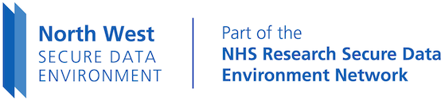

# NWSDE Documentation

The North West Secure Data Environment (NWSDE) is a collaboration between the three North West ICBs (Lancashire & South Cumbria, Greater Manchester and Cheshire & Merseyside) to provide a federated SDE for health data research.
